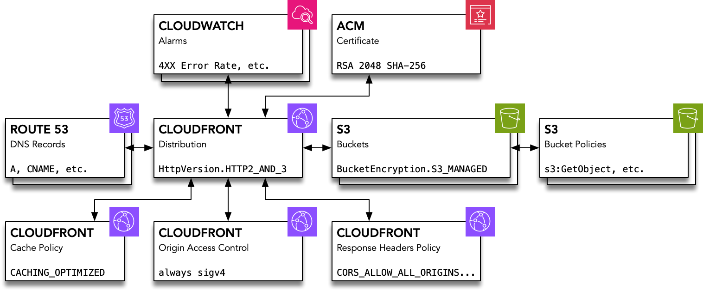

# CloudfrontToS3Stack

## Purpose

This stack provides a solution for a security-minded web interface to static assets, which are encrypted at rest and in transit.

## Services & Resources

The primary services associated with the stack include: ACM, Cloudfront, Cloudwatch (optional), Route53 and S3.

### Outputs

**AWS::CertificateManager::Certificate**

- Provides an ACM certificate for TLS connections to the distribution.

**AWS::CloudFront::Distribution**

- Provides a distribution with a variety of features; for security, these include redirection to https and use of TLS 1.2; for performance, [HTTP/3](https://aws.amazon.com/blogs/aws/new-http-3-support-for-amazon-cloudfront/), compression, and caching for `GET` and `HEAD` requests.

**AWS::CloudFront::OriginAccessControl**

- Defines an [Origin Access Control (OAC)](https://aws.amazon.com/blogs/networking-and-content-delivery/amazon-cloudfront-introduces-origin-access-control-oac/) used to secure access to S3 bucket contents. The OAC uses [AWS Signature Version 4 (SigV4)](https://docs.aws.amazon.com/AmazonS3/latest/API/sig-v4-authenticating-requests.html).

**AWS::Route53::RecordSet (x2)**

- Provides `A` and `CNAME` DNS records that connect the domain name from the certificate to the distribution domain name.

**AWS::S3::Bucket (x2)**

- Buckets for web content and Cloundfront distribution logs are both [blocked from public access](https://docs.aws.amazon.com/AmazonS3/latest/userguide/access-control-block-public-access.html) and encrypted [Amazon S3 managed keys (SSE-S3)](https://docs.aws.amazon.com/AmazonS3/latest/userguide/UsingServerSideEncryption.html).

**AWS::S3::BucketPolicy (x3)**

- Allows CloudFront IAM service principal and your distribution resource to access the S3 bucket
- Uses `aws:SecureTransport` to deny unencrypted bucket connection attempts to both buckets.
- Allows the CloudFront IAM service principal (`cloudfront.amazonaws.com`) and the distribution resource access to the content bucket.

## Configuration
